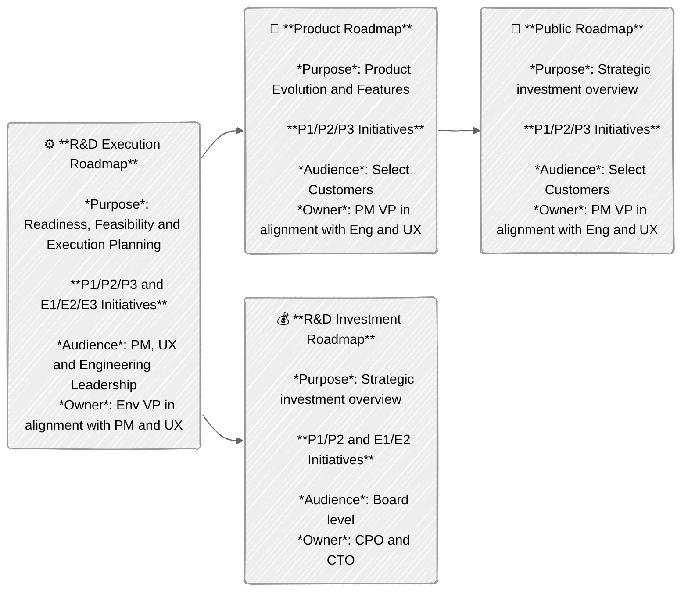
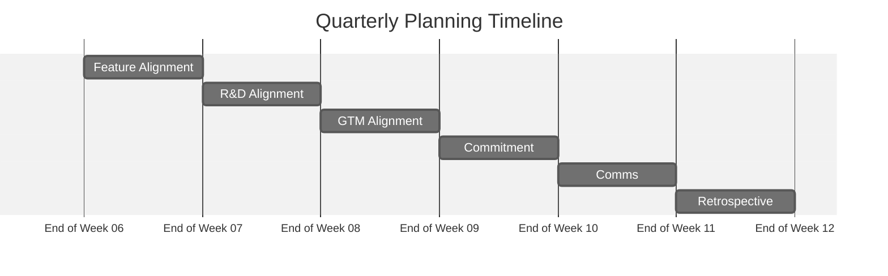

The **R&D Interlock Process** is used to align Product Management, User
Experience, and Engineering teams on roadmap planning and coordinating
execution. The interlock consists of three major components:

- The [Resource Allocation Framework](#resource-allocation-framework) provides a
  structure to map product and engineering driven efforts to the available
  engineering resources.
- The [Roadmap Structure](#roadmap-structure) describes the planning artifacts
  (roadmaps) used for alignment and defines their ownership, purpose and
  audience.
- The [R&D Alignment Process](#rd-alignment-process) provides a process and
  timeline to create alignment for the next execution quarters.

The alignment process outlines a joint approach across product-driven and
engineering-driven initiatives while ensuring clear communication channels with
various stakeholders.

## Resource Allocation Framework

We're establishing a balanced approach between product-led and
engineering-driven initiatives that prioritizes customer needs, quality
standards, and long-term product sustainability. This balance serves as the
foundation for ongoing dialogue between Product Management and Engineering
teams, with the flexibility to adjust ratios as needed for each team's specific
context.

Every initiative is going to be tracked as a separate slide in the
[R&D Execution Roadmap](#rd-execution-roadmap) and (after alignment) represented in
the [R&D Investment Roadmap](#rd-investment-roadmap), the
[Internal Roadmap](#internal-roadmap) and the [Public Roadmap](#public-roadmap).

- ### P1/P2/P3: Product-Driven Initiatives

  - Prioritization Levels
    - P1: 100% Eng Confidence that the complete initiative will be delivered at the committed date
    - P2: 80% Eng Confidence that the complete initiative will be delivered at the committed date
    - P3: 50% Eng Confidence, can be stopped if a P1-2 or E1-2 is at risk.
  - Some but not all P1/P2/P3 projects will be added to the
    [Public Roadmap](#public-roadmap) (owned by GTM) and will be labeled with
    the GTM tiers T1/T2/T3 (reference:
    [definition of GTM tiers](https://docs.google.com/spreadsheets/d/1Pis-VRUYTlitNjoKmDKNQMIf-4bWBo5XjPyWOYo0R54/edit?gid=838006198#gid=838006198&range=B20)).
    - It’s possible that T and P priorities do not strictly match. For example,
      a contractual customer commitment might be a P1 for Product but a T3 for
      GTM. Similarly, a competitive gap might be a P2 for Product but a T3 for
      GTM. It is expected that this divergence of priorities will happen
      frequently.
    - **GTM priorities T1-3 can never be higher (only ever be equal or lower)
      than Product priorities P1-P3, else we’ll run into priority
      inversion. Exceptions need PLT/ELT/MLT approval.**
    - T priorities are externally communicated to stakeholders via
      [Public Roadmap](#public-roadmap)
    - P priorities are externally communicated to stakeholders via
      [Internal Roadmap](#internal-roadmap)

- ### E1/E2/E3: Engineering-Driven Initiatives

  - Prioritization Levels:
    - E1: 100% Eng Confidence that the complete initiative will be delivered at the committed date
    - E2: 80% Eng Confidence that the complete initiative will be delivered at the committed date
    - E3: 50% Eng Confidence, can be stopped if a P1-2 or E1-2 is at risk.
  - Internal visibility only
  - Not externally communicated
  - No dependencies outside of Engineering

Unless approved by the respective VP of Product and/or Engineering, there is a
maximum limit of 1 x (P1 or E1) and 2 x (P2 or E2) per 20 engineers with a
minimum of 1 x P2 per key investment areas (e.g. SCM, CI, Security, Compliance,
Planning, Duo).

Creating a clean alignment ("interlock") between Product and Engineering
requires a structured planning methodology that integrates user requirements
with focused quality improvements and essential technical efforts. This
framework establishes a dual-track system where product-driven initiatives
(P1/P2/P3) operate with explicit resource allocation parameters—P1 receiving
engineering capacity to deliver 100% of planned scope with 100% certainty and
full visibility in external communications, P2 allocated engineering resources
to deliver 100% of planned scope with 80% certainty, both with defined
acceptance criteria. P3 efforts are implemented through iterative development
cycles when capacity permits with a target of 50% confidence. This systematic
approach ensures proper resource allocation while creating a traceable
relationship between committed functionality and execution.

Parallel to these requirement-driven developments, the framework implements a
technical sustainability track (E1/E2/E3) with equivalent resource allocation
metrics but isolated from external dependencies and release communications. This
structure enables critical refactoring, dependency upgrades, test automation
improvements, and infrastructure optimization to proceed with appropriate
prioritization without external scheduling constraints.

The configurable ratio between P-track and E-track allocations provides
implementation flexibility across different system components and architectural
layers, allowing teams to adapt the framework based on technical debt
accumulation, system stability metrics, and component lifecycle
phases—ultimately producing systems that satisfy functional requirements while
maintaining architectural integrity.

## Roadmap Structure

### R&D Execution Roadmap

- **Content:** All P1/P2/P3 and E1/E2/E3 initiatives
- **Cadence:** Quarterly updates, 4-quarter rolling window
- **Audience:** Product and Engineering leadership
- **Owner:** Eng VP in alignment with Product
- **Purpose:** Readiness, Feasibility, and Execution Planning
- **Format:** One deck per section
  ([template](https://docs.google.com/presentation/d/1UTjvJVl544gj9cYrmKeW8KI8dtXBZ6jzxywOuIxRHrI/edit)),
  one roadmap overview for customer and engineering driven initiatives per
  stage, Individual alignment slides for each initiative

### R&D Investment Roadmap

- **Content**: P1/P2 and E1/E2 initiatives (80%+ confidence)
- **Cadence**: Quarterly updates, 4-quarter rolling window
- **Audience**: Board level
- **Owner: CPO and CTO Purpose**: Strategic investment overview

### Internal Roadmap

- **Content**: All P1/P2/P3 features
- **Cadence**: Quarterly updates, 4-quarter rolling window
- **Audience**: Select customers
- **Owner**: PM VP in alignment with Eng and UX
- **Purpose**: Product evolution and feature planning

### Public Roadmap

- **Content**: A subset of P1/P2/P3 product-driven features will be labeled as
  T1/T2/T3 for GTM. **N.b. that GTM priority T1/T2 can never be higher than
  product priority to avoid priority inversion.**
- **Cadence**: Quarterly updates, 4-quarter rolling window
- **Audience**: Customers
- **Owner**: GTM in alignment with Product
- **Purpose**: External commitment tracking



## R&D Alignment Process

The R&D Alignment process produces a generally agreed on
[R&D Execution Roadmap](#rd-execution-roadmap) (and all
[derivative roadmaps](#roadmap-structure)) one quarter ahead of the planning
window. If we’re planning for Q<sub>n</sub> to Q<sub>n+3</sub>, the planning
quarter is prior to execution and marked as Q<sub>n-1</sub> to provide a clear
planning timeline. The alignment process runs in Q<sub>n-1</sub> Week 7-12.



<table>
  <tr>
    <td>
      <h3 id="#feature-definition">Feature Definition</h3>
      <p>Timeline: Q<sub>n-1</sub> Week 1</p>
    </td>
    <td>
      <ul>
        <li>Goal: Assure readiness of alignment
          <ul>
            <li>Phase 1: Outline the <a href="/handbook/product-development/roles-and-responsibilities/#who-what-why-how-and-when">Who, What, and Why</a>
              <ul>
                <li>Business value</li>
                <li>Requirements (use case and pains to address)</li>
                <li>Target user</li>
              </ul>
            <li>
            <li>Phase 2: Assess alignment readiness
              <ul>
                <li>Problem validation</li>
                <li>UX deliverable and solution validation scope</li>
                <li>UX bandwidth and timeline<li>
              </ul>
            </li>
          </ul>
        </li>
        <li>Owner: Phase 1: PLT, Phase 2: UXLT</li>
        <li>
          Participants: PM/PD/Eng Leaders
        </li>
      </ul>
    </td>
  </tr>
  <tr>
    <td>
      <h3 id="#feature-alignment">Feature Alignment</h3>
      <p>Timeline: Q<sub>n-1</sub> Week 8</p>
    </td>
    <td>
      <ul>
        <li>Goal: Create PM/PD/EM alignment on full set of P1-3/E1-3 features</li>
        <li>
          Content:
          <ul>
            <li>Discuss P1/P2/P3 and E1/E2/E3 initial draft ideas</li>
            <li>Identify ownership, dependencies and conflicts</li>
            <li>
              Initial assessment of:
              <ul>
                <li>Technical feasibility</li>
                <li>Engineering bandwidth and timeline</li>
                <li>Resource requirements and Dependencies</li>
                <li>Strategic alignment</li>
                <li>Customer Zero requirements and enablement</li>
              </ul>
            </li>
            <li>
              Improvements (Quality, stability, security etc.) should be mapped
              as either P or E driven initiatives
            </li>
          </ul>
        </li>
        <li>
          Artifact: Stage-level alignment slides in
          <a href="#rd-execution-roadmap">R&amp;D Execution Roadmap</a>
        </li>
        <li>Owner: PLT/ELT</li>
        <li>
          Participants: Group PM/PDM/EM for each capability under consideration
        </li>
        <li>Format: Sync or async, as preferred by group-level teams</li>
      </ul>
    </td>
  </tr>
  <tr>
    <td>
      <h3 id="#rd-alignment-discussion">R&amp;D Alignment Discussion</h3>
      <p>Timeline: Q<sub>n-1</sub> Week 9</p>
    </td>
    <td>
      <ul>
        <li>
          Goal: Align Product & Engineering leadership on:
          <ul>
            <li>
              Scope and importance of capability to customer, quality and needs
            </li>
            <li>Ability to commit to proposed E/P priority ranking</li>
          </ul>
        </li>
        <li>
          Content:
          <ul>
            <li>
              Discussion to align on:
              <ul>
                <li>Customer Problem and Business Value</li>
                <li>
                  Definition of Good: Clear user experience, success and
                  landing criteria
                </li>
                <li>Proposed priority</li>
                <li>Resource requirements</li>
                <li>Initial UX and Eng timeline estimates</li>
                <li>Dependencies identification</li>
                <li>Risk assessment</li>
              </ul>
            </li>
          </ul>
        </li>
        <li>
          Topic Granularity: Minimum threshold of 1 FTE quarter
          <ul>
            <li>
              Smaller initiatives are aggregated as milestones into thematic
              features
            </li>
          </ul>
        </li>
        <li>
          Artifact:
          <a href="#rd-execution-roadmap">R&amp;D Execution Roadmap</a> with one
          joint alignment slide per feature (<a
            href="https://www.google.com/url?q=https://docs.google.com/presentation/d/1UTjvJVl544gj9cYrmKeW8KI8dtXBZ6jzxywOuIxRHrI/edit"
            >template</a
          >)
        </li>
        <li>Owner: PLT/ELT/UXLT</li>
        <li>
          Participants:
          <ul>
            <li>E-track: EM responsible for capability</li>
            <li>P-track: PM/PDM/EM responsible for capability</li>
          </ul>
        </li>
      </ul>
    </td>
  </tr>
  <tr>
    <td>
      <h3 id="#gtm-alignment-discussion">GTM Alignment Discussion</h3>
      <p>Timeline: Q<sub>n-1</sub> Week 10</p>
    </td>
    <td>
      <ul>
        <li>
          Goal: Align R&amp;D and GTM leadership on:
          <ul>
            <li>Scope and importance of capability to GTM considerations</li>
            <li>Ability to commit to proposed T priority ranking</li>
          </ul>
        </li>
        <li>
          Content:
          <ul>
            <li>
              Pre-read: R&amp;D joint alignment slide in
              <a href="#rd-execution-roadmap">R&amp;D Execution Roadmap</a>
            </li>
            <li>Discussion artifact: Proposed T priorities from GTM</li>
          </ul>
        </li>
        <li>Owner: MLT</li>
        <li>Participants: ELT, PLT & MLT</li>
      </ul>
    </td>
  </tr>
  <tr>
    <td>
      <h3 id="#final-prioritization-and-commitment">
        Final Prioritization and Commitment
      </h3>
      <p>Timeline: Q<sub>n-1</sub> Week 11</p>
    </td>
    <td>
      <ul>
        <li>
          Goal: Document outcome of alignment discussions in
          <a href="#rd-execution-roadmap">R&amp;D Execution Roadmap</a>
        </li>
        <li>
          Content:
          <ul>
            <li>Final T/P/E assignments</li>
            <li>Delivery timeline commitment</li>
            <li>Resource allocation confirmation</li>
            <li>Identification of dependencies</li>
            <li>Documentation of risks</li>
          </ul>
        </li>
        <li>
          Owner:
          <ul>
            <li>E-track: EM responsible for capability, Eng VP signoff</li>
            <li>
              P-track: PM, PDM, & EM responsible for capability, PM, UX, and Eng VP signoff
            </li>
          </ul>
        </li>
        <li>Format: Async</li>
      </ul>
    </td>
  </tr>
  <tr>
    <td>
      <h3 id="#upstream-communication">Upstream Communication</h3>
      <p>Timeline: Q<sub>n-1</sub> Week 12</p>
    </td>
    <td>
      <ul>
        <li>
          Aligned P1-3 initiatives integrated into
          <a href="#internal-roadmap">Internal Roadmap</a>
        </li>
        <li>
          P1/P2 and E1/E2 initiatives integrated into
          <a href="#rd-investment-roadmap">R&amp;D Investment Roadmap</a>
        </li>
        <li>
          Select P1/P2 initiatives integrated into
          <a href="#public-roadmap">Public Roadmap</a> as T1/T2, n.b. that GTM
          priority T1/T2 can never be higher than product priority to avoid
          priority inversion.
        </li>
      </ul>
    </td>
  </tr>
  <tr>
    <td>
      <h3 id="#retrospective">Retrospective</h3>
      <p>Timeline: Q<sub>n</sub> Week 1</p>
    </td>
    <td>
      <ul>
        <li>
          Goal: Learn from prior planning cycle and identify any changes that
          need to be implemented going forward.
        </li>
        <li>
          Content: Collect, discuss and incorporate feedback from prior planning
          iteration
        </li>
        <li>Artifact: Q<sub>n-2</sub> Planning Retrospective.</li>
        <li>Owners: PLT/ELT</li>
        <li>Participants: Planners at Section and Stage Level</li>
      </ul>
    </td>
  </tr>
</table>

## Success Metrics

- Roadmap alignment with company goals
- Planning efficiency (time spent planning and aligning, effort sizing,
  customer / quality / sustainability balance)
- Planning and execution accuracy (Delivery against commitments in time)

## Commitment Change Requests

Any major changes to the timeline, scope, cost, priority, quality or risk for a
committed feature of priorities P1/E1 and P2/E2 should be raised to respective
PLT and ELT members as well as CPO and CTO through a **Commitment Change Request**
to get explicit approval and keep all stakeholders in the loop:

1. Project DRIs a comment as a new thread on the relevant interlock epic, and a link to the comment in
   [\#r-and-d-roadmap-changes](https://gitlab.enterprise.slack.com/archives/C08G1GJLKN0),
   mentioning the respective stakeholders. The epic comment should follow a standardized
   format, so decision makers can quickly respond / act:

   ```text
   ### Proposing change to feature

   - Change Type: [select: Timeline / Scope / Cost / Priority / Quality / Risk]
   - What’s changing: <Priority from XX to YY>, <Delivery Milestone from YY.Y to ZZ.Z>, …
   - Background: [2-3 sentences describing the decision]
   - Impact: [optional, further detail on impact to customers / cost / list of projects that are dependent on this project + @ mentions of DRIs for those projects]
   - Proposed by: [Name of Product and Engineering DRI]
   - Approvers: [specific PLT, ELT members], CPO, CTO

   <more narrative / details of change, motivation, impact>
   ```

2. Free form discussion on the epic comment as a thread, optional meeting
3. Approval to commit to change from CPO and CTO

Any change that constitutes a slip in deadline, a significant reduction in
scope, or anything else that would make us miss customer expectations
constitutes a major change. *If in doubt, go through the change management
process.*

## GitLab Process

The Interlock process has moved to GitLab epics within the `gitlab-org/` group, starting with planning quarter FY27-Q1. 

Generally, where implementation work can be public, use an [internal note](https://docs.gitlab.com/user/discussions/#add-an-internal-note) to make notes or discuss any sensitive information. Examples include, but are not limited to, customer names, ARR impact, and other business details that shouldn't be publicly visible.

If the implementation work is not in the `gitlab-org/` group, a separate interlock epic should be created using the [provided template](https://gitlab.com/groups/gitlab-org/-/epics/new?description_template=interlock_template). Each interlock epic should be linked to its corresponding workstream epic, allowing for easy navigation and drilldown into the actual implementation work. The interlock epic should be used to discuss anything related to the interlock process, and regularly updated with a summary on its "health" and progress.

### GitLab's Product Roadmap R&D Interlock Process 


### When to use this process

Not all work requires going through this interlock process. Regular development work that doesn't require cross-functional alignment, significant resource commitment, or go-to-market coordination can continue to use standard workstream epics and issues. 

Work proposed via the R&D Interlock process will benefit from:

- **Executive visibility**: Items in this process receive visibility at the highest levels of the organization
- **Go-to-market coordination**: Customer-facing items may be included in GTM planning depending on `GTM tier`, enabling sales and marketing alignment
- **Resource commitment**: Formal engineering commitment at specified confidence levels
- **Cross-functional alignment**: Ensures Product, Engineering, and GTM teams are aligned on priorities
- **External communication**: Select items may be included in public/customer-facing roadmaps

### How to create a candidate for proposal

1. **Create an Epic** if existing epic is outside of `gitlab-org`
   1. Within https://gitlab.com/gitlab-org, create a new epic ([docs](https://docs.gitlab.com/user/group/epics/manage_epics/#create-an-epic))
   1. Copy (for existing) or select (for new) the epic template named: [interlock_template](https://gitlab.com/groups/gitlab-org/-/epics/new?description_template=interlock_template)
1. **Complete required information**
   1. Fill in all sections of the template
   1. Assign DRIs (PM, EM, UXPD&PDM)
   1. Apply appropriate labels (see [Labels Guide](https://gitlab.com/groups/gitlab-org/gitlab-rd-planning/-/wikis/R&D-Interlock-Process-Dashboard#labels-guide))
1. **Update interlock status throughout process**
   1. Update interlock status as discussions progress
   1. After the quarter begins, update health status weekly
   1. Document risks and dependencies as they emerge

### Labels Guide

| Label               | Values| Purpose|
|--------------------------|--------------------|-------------------|
| Interlock candidate      | ~"Interlock candidate"| Identifies epics as part of the R&D Interlock process; automatically applied through the epic template |
| Section                  | ~"section::analytics" <br> ~"section::growth" <br> ~"section::ops" <br> *more labels available in series....*| Indicates which high-level organizational section the work belongs to, allowing for filtering across departments |
| Stage                    | ~"devops::plan" <br> ~"devops::create" <br> ~"devops::verify" <br> *more labels available in series....*| Specifies which product stage is responsible for the work; enables stage leaders to view all commitments for their area |
| Group                    | ~"group::authorization" <br> ~"group::dedicated" <br> ~"group::knowledge" <br> *more labels available in series....*| Identifies the specific team responsible for implementation; allows teams to filter for just their own commitments |
| Interlock priority     |  ~"Interlock Priority::E1" <br> ~"Interlock Priority::E2" <br> ~"Interlock Priority::E3" <br> ~"Interlock Priority::P1" <br> ~"Interlock Priority::P2"  <br> ~"Interlock Priority::P3"| Interlock Priority labels indicate the level of confidence and commitment for both Product-driven (P1/P2/P3) and Engineering-driven (E1/E2/E3) initiatives. <br><br> - P1/E1 indicates 100% confidence in delivery with full resource commitment. <br> - P2/E2 indicates 80% confidence in delivery. <br>- P3/E3 indicates 50% confidence and may be deprioritized if P1/P2 or E1/E2 items are at risk. <br><br> Product priority (P) labels are used for customer-facing features, while Engineering priority (E) labels are used for technical improvements with internal visibility only. |
| Go-to-market tier        | ~"GTM tier::Tier 1" <br> ~"GTM tier::Tier 2" <br> ~"GTM tier::Tier 3"| GTM tier labels apply to a subset of Product-driven initiatives that will be communicated externally to customers and stakeholders. They represent Go-To-Market priority and visibility: <br><br> - Tier 1: Highest confidence, externally communicated commitments  <br> - Tier 2: High confidence items communicated to customers <br> - Tier 3: Directional items that may be communicated externally <br><br> GTM tiers are suggested during the collaboration phase, then finalized during the GTM Alignment Discussion (Week 10) with input from Marketing and Sales leadership. GTM priority tiers can never be higher than their corresponding Product priority (P1-P3) to avoid priority inversion. |
| Investment theme         | ~"Investment theme::AI across SDLC" <br> ~"Investment theme::Core DevOps" <br> ~"Investment theme::Security & Compliance"                   | Connects work to company's strategic investment areas as outlined in the FY26 company strategy; enables filtering to track progress on key company initiatives |
| Subscription tier        | ~"GitLab Free" <br> ~"GitLab Premium" <br> ~"GitLab Ultimate"                                                                                | Specifies which GitLab subscription tier(s) will include the feature; helps with planning go-to-market activities |
| Platform| ~"platform: GitLab.com" <br> ~"platform: dedicated" <br> ~"platform: dedicated for gov" <br> ~"platform: self-managed" | Indicates in which delivery platform the feature will be available |
| Quarters                 | ~"FY27::Q1" <br> ~"FY27::Q2" <br> ~"FY27::Q3" <br> *more labels available in series....*                                                     | Indicates the target delivery quarter for planning and tracking purposes; critical for filtering by timeframe |
| Interlock status labels  | ~"Interlock status::New/Proposal in progress" <br> ~"Interlock status::Alternate proposed" <br> ~"Interlock status::Ready for review" <br> ~"Interlock status::GPM/Director approved" <br> ~"Interlock status::VP approved" <br> ~"Interlock status::Canceled" <br> ~"R&D roadmap status::Executing" <br> ~"R&D roadmap status::Completed" | Tracks the current state of the epic in the interlock process; updated as the epic progresses through review stages; drives board views and reporting |
| Health                   | ~"health::on track" <br> ~"health::needs attention" <br> ~"health::at risk"                                                                  | Indicates the delivery risk during execution phase; updated weekly by EMs once the quarter begins; helps leadership identify items requiring intervention <br><br> *(Note: we are using labels for health status until epic boards can utilize the [health status](https://docs.gitlab.com/user/group/epics/manage_epics/#health-status) feature)* |

### Future feature enhancements

The Plan stage has an incredible product roadmap for this year, with many items that will directly improve this interlock process. See below for upcoming features and let us know if you have ideas for additional improvements!

- **Epic milestones** - Replace quarter labels with proper milestone functionality, including the milestone burndown charts to see how the quarter is performing at a glance
- **Custom fields** - Reduce label sprawl by using fields instead of labels
- **Enhanced board capabilities** - Use expanded swimlane options (horizontal groupings) to reduce filters and saved views
- **Customizable metadata display** - Remove noise from executive views by controlling visible fields

## FAQs

<summary>Click to expand</summary>

1. **Q:** Why are we using epics instead of issues?
   - **A:** In future iterations, as the Plan features mature, our goal is to get this process into the Roadmap view, and eventually, connect the workstream to the strategy (plan) to enable drill down and progress information.
1. **Q:** Why don't we create these epics in a separate group from `gitlab-org`?
   - **A:** I've learned that we have hundreds of internal groups that the SRE team has to keep safe. Rather than piling on, I've chosen to use the main `gitlab-org` group as a boring solution. If this causes noise or concern we can revisit the decision.
1. **Q:** Is there a reason why we can't use the native health status widget instead of labels?
   - **A:** We are using labels for health status until epic boards can utilize the [health status](https://docs.gitlab.com/user/group/epics/manage_epics/#health-status) feature
1. **Q:** Can I save my own views for this process?
   - **A:** Of course, let us know if you have any questions about filter criteria or label usage.
1. **Q:** Do I need to make my epic confidential since I'm mentioning customer information?
   - **A:** No, the group https://gitlab.com/gitlab-org/gitlab-rd-planning is private, so there is no need to make your epic confidential.

</details>
